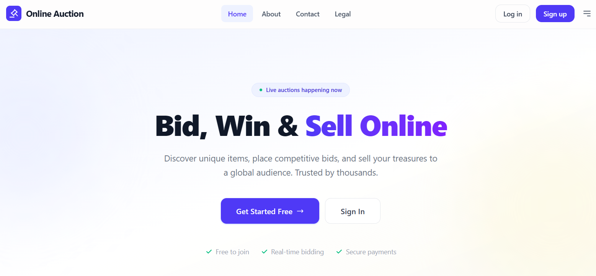
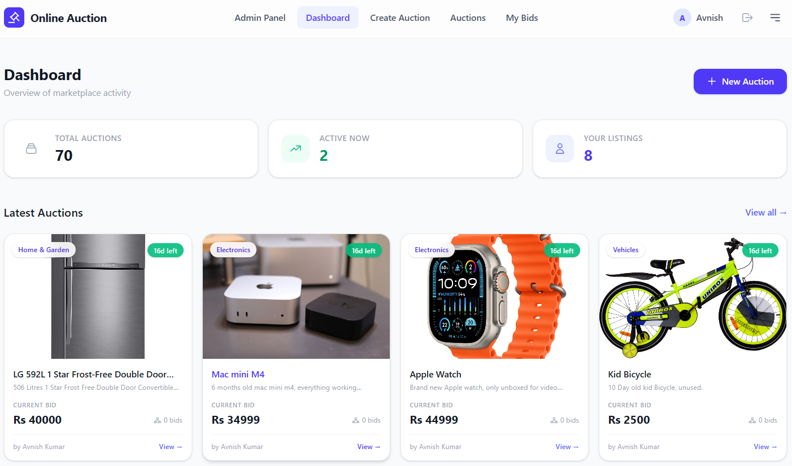
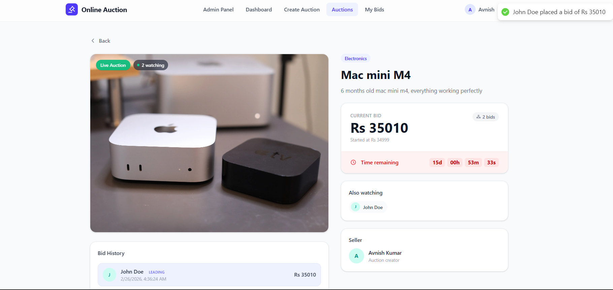
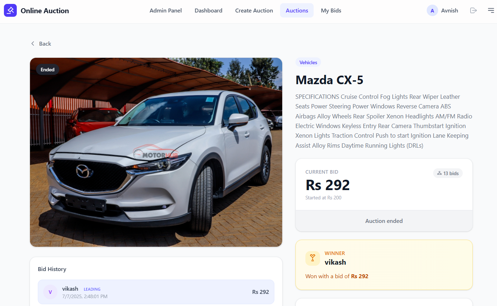
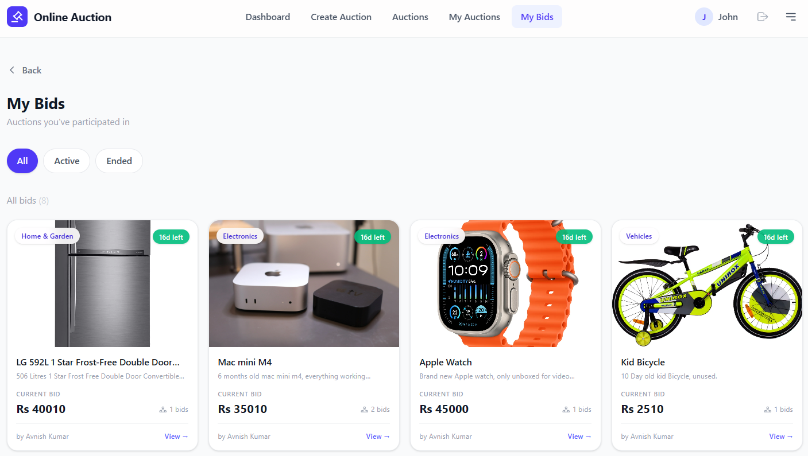
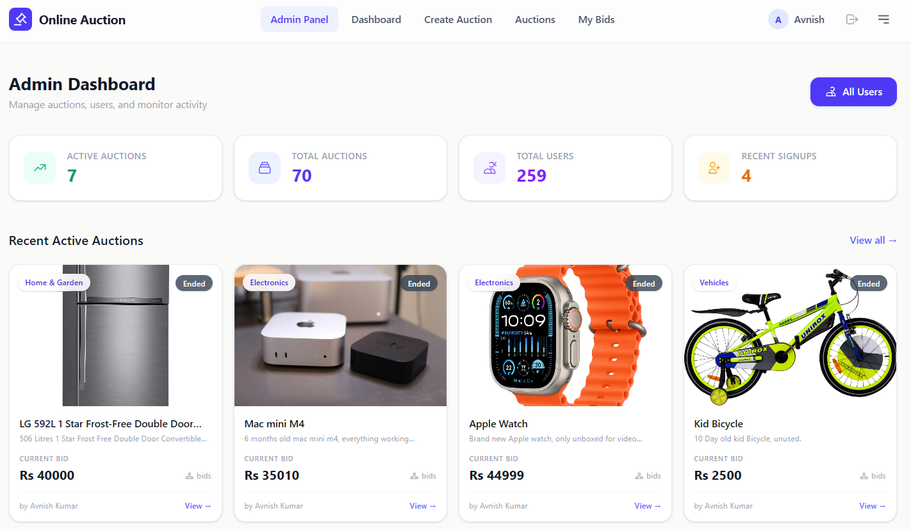

<div align="center">

# 🔨 Online Auction System

**A production-grade, real-time auction platform built with the MERN stack**

[](https://auction.ihavetech.com)


[Live Demo](https://auction.ihavetech.com) · [Report Bug](https://github.com/theavnishkumar/online-auction-system/issues) · [Request Feature](https://github.com/theavnishkumar/online-auction-system/issues) · [Architecture](./ARCHITECTURE.md) · [Learning Guide](./LEARNING_GUIDE.md)

</div>

---

## 📖 Overview

Most auction tutorials stop at basic CRUD. This project goes further — it's a **full-stack, deployment-ready auction platform** with real-time bidding, production security, and CI/CD pipelines.

Built as a Computer Science Engineering major project, it serves as a real-world reference for full-stack MERN development.

> 📚 New here? Start with the [Architecture Guide](./ARCHITECTURE.md) to understand the system design, then the [Learning Guide](./LEARNING_GUIDE.md) to explore what's built and what you can add next.

---

## ✨ Features

### 🔐 Authentication
- JWT with httpOnly secure cookies
- Auto-login on page refresh
- Role-based access control (User / Admin)
- Password change with validation

### 🏷️ Auctions
- Signed Cloudinary image upload with instant preview & progress bar
- Paginated auction listing with category filters
- Live countdown timers
- Auto-winner detection on auction expiry

### ⚡ Real-Time Bidding
- Socket.io room-based architecture
- Atomic bid updates (race condition prevention)
- Live active user count per auction
- Instant bid broadcast to all viewers
- Sellers cannot bid on their own auctions

### 📊 Dashboard & Admin
- Personal stats: total/active auctions, recent activity
- Admin panel: system-wide stats, user management with search, sort & pagination

### 🔒 Security
- Login tracking: IP, geo-location, device, browser
- Full login history per user
- bcrypt password hashing
- Environment variable validation at startup

### 📧 Email
- Contact form via Resend
- Dual email: admin notification + user confirmation
- XSS-safe HTML templates

### 🚀 Performance & Deployment
- React Query caching + hover-based prefetching
- View Transitions API page animations
- gzip compression + optimized MongoDB indexes
- GitHub Actions CI/CD → AWS EC2
- Vercel serverless frontend support
- PM2 process management with graceful shutdown

---

## 🛠️ Tech Stack

| Layer | Technologies |
|---|---|
| **Frontend** | React 19, Vite, Tailwind CSS v4, React Router v7, Redux Toolkit, TanStack React Query, Socket.io Client |
| **Backend** | Node.js, Express 5, MongoDB, Mongoose, Socket.io, JWT, bcrypt, Cloudinary, Resend |
| **Infrastructure** | AWS EC2, Vercel, GitHub Actions, PM2, Cloudinary CDN |

---

## 📸 Screenshots

| Landing Page | User Dashboard | Auction Page |
|:---:|:---:|:---:|
|  |  |  |

| Auction Winner | My Bids | Admin Panel |
|:---:|:---:|:---:|
|  |  |  |

---

## 🚀 Quick Start

### Prerequisites

- **Node.js** 20+
- **MongoDB** (local or [Atlas](https://www.mongodb.com/atlas))
- **Cloudinary** account ([free tier](https://cloudinary.com/))

### 1. Clone & Install

```bash
git clone https://github.com/mauryaharsh784/online-auction-system.git
cd online-auction-system

# Install backend dependencies
cd server && npm install

# Install frontend dependencies
cd ../client && npm install
```

### 2. Configure Environment Variables

**`server/.env`**
```env
PORT=3000
ORIGIN=http://localhost:5173
MONGO_URL=mongodb://localhost:27017/auction
JWT_SECRET=your-secret-key-here
JWT_EXPIRES_IN=7d
CLOUDINARY_CLOUD_NAME=your-cloud-name
CLOUDINARY_API_KEY=your-api-key
CLOUDINARY_API_SECRET=your-api-secret
CLOUDINARY_URL=cloudinary://...
RESEND_API_KEY=re_xxxxxxxxxxxx
```

**`client/.env`**
```env
VITE_API=http://localhost:3000
VITE_AUCTION_API=http://localhost:3000/auction
```

### 3. Run

```bash
# Terminal 1 — Backend
cd server && npm run dev

# Terminal 2 — Frontend
cd client && npm run dev
```

Open **http://localhost:5173** and you're live!

---

## 📁 Project Structure

```
online-auction-system/
├── client/                      # React frontend
│   └── src/
│       ├── components/          # Reusable UI (Navbar, AuctionCard, Footer)
│       ├── pages/               # Route pages (Dashboard, ViewAuction, etc.)
│       ├── hooks/               # React Query hooks + Socket hook
│       ├── services/            # Axios API service layer
│       ├── store/               # Redux Toolkit (auth state)
│       ├── layout/              # Layout wrappers (Main, Admin, Open)
│       └── routers/             # Route definitions
│
├── server/                      # Express backend
│   ├── controllers/             # Route handlers
│   ├── models/                  # Mongoose schemas (User, Product, Login)
│   ├── routes/                  # REST API routes
│   ├── socket/                  # Socket.io init + auction handlers
│   ├── middleware/              # Auth middleware
│   ├── services/                # Cloudinary integration
│   ├── utils/                   # JWT, cookies, geo-location helpers
│   ├── config/                  # DB + env configuration
│   ├── app.js                   # Express app setup
│   └── server.js                # HTTP server + Socket.io + graceful shutdown
│
├── .github/workflows/           # CI/CD pipeline
└── README.md
```

---

## 🏗️ Architecture

### Real-Time Bidding Flow

```
Client (ViewAuction)
│
├── useSocket hook (WebSocket)          REST API (HTTP)
│   ├── Connect & join room      ───►   POST /auction/:id/bid
│   ├── Listen for bid events           │  Atomic findOneAndUpdate
│   └── Cleanup on unmount              │  (price condition check)
│                                       │
└── ◄── auction:bidPlaced broadcast ────┘
         (to all room members)
                │
           MongoDB
      (race condition: only first
       concurrent bid succeeds)
```

**Race condition prevention:** `findOneAndUpdate` with a price condition ensures that if two users bid simultaneously, only the highest valid bid succeeds. The other receives a retry prompt.

### Auth Flow

```
Login / Signup
     │
     ▼
Server sets httpOnly cookie (auth_token)
     │
     ▼
Page Refresh → checkAuth() dispatches GET /user
     │
     ▼
Cookie sent automatically → returns { user } or 401
     │
     ▼
Redux updates auth state → protected routes render
```

---

## 📡 API Reference

> Full documentation with request/response examples: [`server/README.md`](./server/README.md)

### Auth

| Method | Endpoint | Description |
|---|---|---|
| `POST` | `/auth/signup` | Register new user |
| `POST` | `/auth/login` | Login (sets httpOnly cookie) |
| `POST` | `/auth/logout` | Logout (clears cookie) |

### User

| Method | Endpoint | Description | Auth |
|---|---|---|---|
| `GET` | `/user` | Get current user profile | ✅ |
| `PATCH` | `/user` | Change password | ✅ |
| `GET` | `/user/logins` | Login history (last 10) | ✅ |

### Auctions

| Method | Endpoint | Description | Auth |
|---|---|---|---|
| `GET` | `/auction` | List auctions (paginated) | ✅ |
| `POST` | `/auction` | Create auction | ✅ |
| `GET` | `/auction/stats` | Dashboard statistics | ✅ |
| `GET` | `/auction/myauction` | User's own auctions | ✅ |
| `GET` | `/auction/mybids` | Auctions user has bid on | ✅ |
| `GET` | `/auction/:id` | Single auction detail | ✅ |
| `POST` | `/auction/:id/bid` | Place a bid | ✅ |

### Admin

| Method | Endpoint | Description | Auth |
|---|---|---|---|
| `GET` | `/admin/dashboard` | System statistics | 🔑 Admin |
| `GET` | `/admin/users` | User list (paginated, searchable) | 🔑 Admin |

### Other

| Method | Endpoint | Description | Auth |
|---|---|---|---|
| `GET` | `/upload/signature` | Signed Cloudinary upload params | ✅ |
| `POST` | `/contact` | Submit contact form | Public |

---

## 🔌 Socket.io Events

| Event | Direction | Payload |
|---|---|---|
| `auction:join` | Client → Server | `{ auctionId }` |
| `auction:leave` | Client → Server | `{ auctionId }` |
| `auction:bid` | Client → Server | `{ auctionId, bidAmount }` |
| `auction:userJoined` | Server → Room | `{ userName, userId, activeUsers[] }` |
| `auction:userLeft` | Server → Room | `{ userName, userId, activeUsers[] }` |
| `auction:bidPlaced` | Server → Room | `{ auction, bidderName, bidAmount }` |
| `auction:error` | Server → Client | `{ message }` |

All socket connections are authenticated via JWT from cookies. Users are tracked per room with automatic cleanup on disconnect.

---

## ☁️ Deployment

### Frontend → Vercel

```bash
cd client && npm run build
# Deploy via Vercel CLI or GitHub integration
```

### Backend → AWS EC2 (Automated CI/CD)

The included GitHub Actions workflow (`.github/workflows/deploy.yml`) auto-deploys on every push to `main`.

**Setup steps:**
1. Add the required GitHub Secrets (see table below)
2. Set up EC2 with Node.js 20+, PM2, Git, and SSH keys
3. Push to `main` → workflow SSHs into EC2, pulls code, writes `.env`, restarts PM2

<details>
<summary><b>Required GitHub Secrets</b></summary>

| Secret | Description |
|---|---|
| `EC2_HOST` | EC2 public IP |
| `EC2_USERNAME` | SSH user (e.g. `ubuntu`) |
| `EC2_SSH_KEY` | Private SSH key |
| `EC2_SSH_PORT` | SSH port (default: `22`) |
| `EC2_PROJECT_PATH` | Project directory on EC2 |
| `PORT` | Server port |
| `ORIGIN` | Frontend URL for CORS |
| `MONGO_URL` | MongoDB connection string |
| `JWT_SECRET` | JWT signing secret |
| `JWT_EXPIRES_IN` | Token expiry (e.g. `7d`) |
| `COOKIE_DOMAIN` | Cookie domain for production |
| `CLOUDINARY_CLOUD_NAME` | Cloudinary cloud name |
| `CLOUDINARY_API_KEY` | Cloudinary API key |
| `CLOUDINARY_API_SECRET` | Cloudinary API secret |
| `CLOUDINARY_URL` | Cloudinary URL |
| `RESEND_API_KEY` | Resend email API key |

</details>

---

## 🤝 Contributing

Contributions are welcome and greatly appreciated!

1. **Fork** the repository
2. **Create** a feature branch: `git checkout -b feature/amazing-feature`
3. **Commit** using [Conventional Commits](https://www.conventionalcommits.org/): `git commit -m "feat: add amazing feature"`
4. **Push** to your branch: `git push origin feature/amazing-feature`
5. **Open** a Pull Request

### 💡 Ideas for Contribution

- **Payment integration** — Stripe or Razorpay for winning bids
- **Push notifications** — Real-time bid alerts via WebPush
- **Advanced search** — Full-text search with filters
- **User ratings** — Buyer/seller reputation system
- **Email notifications** — Automated auction activity emails
- **Testing** — Unit and integration test coverage
- **Accessibility** — WCAG compliance improvements

---

## 📄 License

Distributed under the **MIT License**. See [LICENSE](LICENSE) for details.

---

<div align="center">

Built with ❤️ by [Harsh Vardhan Maurya](https://github.com/mauryaharsh784)

If this project helped you, please consider giving it a ⭐

[⬆ Back to Top](#-online-auction-system)

</div>